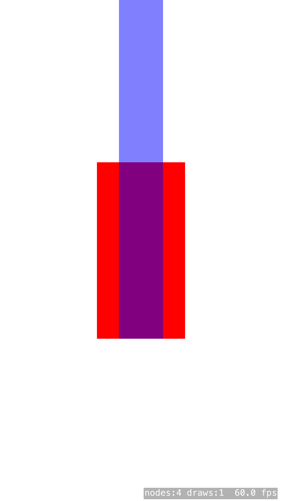

EMScrollView
-----------------------
A simple Objective-C SpriteKit scrollview.

Features
-----------------------
- A simple SKSpriteNode;
- Based on the Cocos2d scrollview implementation (CCScrollView);
- Easy to import and implement;
- Free for any use, including commercial;
- iOS oriented;
- Written in Objective-C;

Usage
-----------------------
        SKSpriteNode* content = [SKSpriteNode spriteNodeWithColor:[UIColor clearColor] size:CGSizeMake(50, 500)];
        content.anchorPoint = ccp(0.5, 1.0);
        
        EMScrollView* scrollView = [EMScrollView scrollViewWithContentNode:content Size:CGSizeMake(100, 200)];
        scrollView.horizontalScrollEnabled = NO;
        scrollView.verticalScrollEnabled = YES;
        
        SKSpriteNode* background = [SKSpriteNode spriteNodeWithColor:[UIColor colorWithRed:0 green:0 blue:1 alpha:0.5] size:CGSizeMake(50, 500)];
        background.anchorPoint = ccp(0.5, 1.0);
        background.position = CGPointMake(0, 0.5 * _scrollView.size.height);
        [content addChild:background];
        
        [self addChild:scrollView];
        
Initial position                  |  Fully scrolled
:--------------------------------:|:-----------------------------------:
  |  

